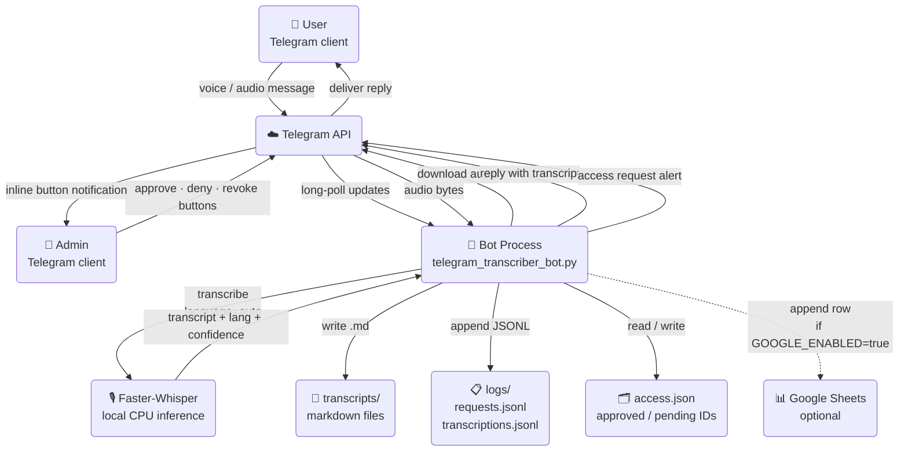
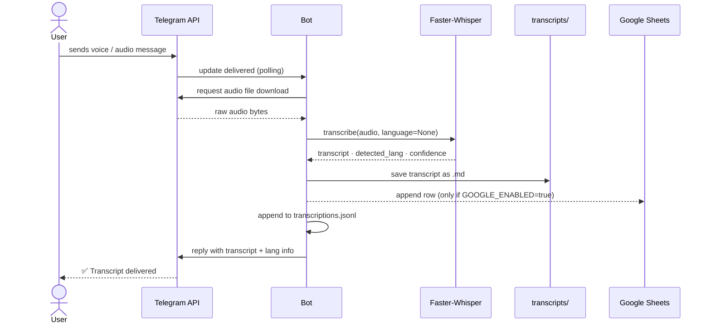
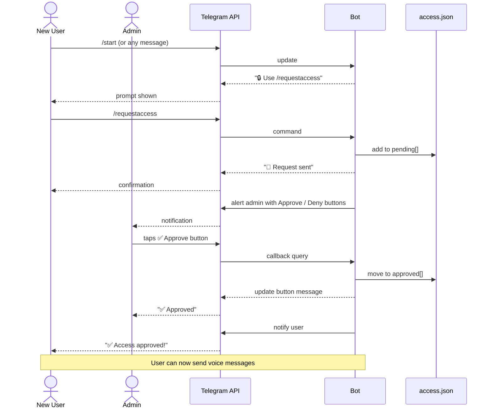

# System Architecture

## Components

The bot has no external service dependencies for its core function. Transcription runs entirely on local hardware. Google Sheets is an optional cloud sink.

---

## Transcription flow

What happens when a user sends a voice message.

---

## Access control flow

What happens when a new user tries to use the bot.

